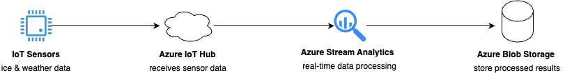

# FinalProjectAssignment

<!-- 

Insturction:
https://github.com/ramymohamed10/25W_CST8916_Final_Project_Assignment

Repo:
https://github.com/degu0055/FinalProjectAssignment 

Reference - Repo:
https://github.com/ramymohamed10/CST8916-Week12-IoT-Data-Streaming

Reference - Video
https://brightspace.algonquincollege.com/d2l/le/content/748188/viewContent/11197686/View

-->

## 1. Scenario Description:
<!-- 

✓Provide an overview of the Rideau Canal Skateway monitoring scenario and explain the problem your solution addresses. 

-->

The Rideau Canal Skateway in Ottawa is a well-loved winter destination that must ensure safety for its skaters. Since ice conditions and weather can vary rapidly, the National Capital Commission (NCC) seeks a method to track these changes in real time.

This project models IoT sensors installed along the canal to monitor ice thickness, temperature, and weather conditions. The information is transmitted to Azure IoT Hub, analyzed by Azure Stream Analytics to identify hazardous situations, and stored in Azure Blob Storage for additional examination. This assists the NCC in making prompt decisions to ensure the safety of skaters.

## 2. System Architecture:
<!-- 
✓Include a clear diagram illustrating the data flow:
- IoT sensors pushing simulated data to Azure IoT Hub.
- Azure Stream Analytics processing the incoming data.
- Processed data being stored in Azure Blob Storage. 
-->



## 3. Implementation Details:
<!-- 

✓IoT Sensor Simulation:
- Describe how the simulated IoT sensors generate and send data to Azure IoT Hub.
- Include the structure of the JSON payload and any scripts or applications used. 

✓Azure IoT Hub Configuration:
 - Explain the configuration steps for setting up the IoT Hub, including endpoints and message routing.

✓Azure Stream Analytics Job:
- Describe the job configuration, including input sources, query logic, and output destinations.
- Provide sample queries used for data processing. 

✓Azure Blob Storage:
- Explain how the processed data is organized in Blob Storage (e.g., folder structure, file naming convention).
- Specify the formats of stored data (JSON/CSV). 

-->
**IoT Sensor Simulation:**
- A Python script or a Node.js app creates random but realistic sensor readings, like ice thickness, air temperature, and wind speed, at regular intervals. It formats this data into a JSON payload and sends it to Azure IoT Hub using the Azure IoT SDK.

JSON
```json 
{
  "deviceId": "sensor-rideau-001",
  "timestamp": "2025-04-12T14:30:00Z",
  "iceThicknessCm": 28.5,
  "airTemperatureC": -12.3,
  "windSpeedKmh": 15.7
}
```

Python
```python
import time
import random
import json
from azure.iot.device import IoTHubDeviceClient, Message

CONNECTION_STRING = "HostName=your-iot-hub.azure-devices.net;DeviceId=sensor-rideau-001;SharedAccessKey=..."

def get_sensor_data():
    return {
        "deviceId": "sensor-rideau-001",
        "timestamp": time.strftime("%Y-%m-%dT%H:%M:%SZ", time.gmtime()),
        "iceThicknessCm": round(random.uniform(10.0, 35.0), 1),
        "airTemperatureC": round(random.uniform(-25.0, 5.0), 1),
        "windSpeedKmh": round(random.uniform(0.0, 30.0), 1)
    }

def main():
    client = IoTHubDeviceClient.create_from_connection_string(CONNECTION_STRING)

    print("Sending sensor data to IoT Hub...")
    try:
        while True:
            data = get_sensor_data()
            message = Message(json.dumps(data))
            client.send_message(message)
            print(f"Sent message: {data}")
            time.sleep(5)
    except KeyboardInterrupt:
        print("Stopped sending messages.")
    finally:
        client.disconnect()

if __name__ == "__main__":
    main()

```

**Azure IoT Hub Configuration:**

Create an IoT Hub
- Go to the Azure Portal.
- Search for IoT Hub and click Create.
- Set a name, select a resource group, and choose the Free Tier (for testing).
- Click Review + Create, then Create.  

Register a Device
- In your IoT Hub, go to the Devices section.
- Click + Add Device.
- Enter a Device ID (e.g., Sensor1) and click Save.
- Click the device name to view its connection string — copy it for later use.

Understand Endpoints
- IoT Hub sends messages to endpoints. The default endpoint is:
    - messages/events → This is where device telemetry data goes.
- You can also define custom endpoints (e.g., to Blob Storage, Event Hubs, etc.) under the "Message Routing" section.

**Azure Stream Analytics Job:**
Input Sources
- Type: IoT Hub
- Source: Real-time telemetry data simulated by a Python script
- Connection Parameters:
    - IoT Hub Namespace: Your specific IoT Hub name
    - Policy Name: iothubowner
    - Consumer Group: $Default (or custom)
    - Serialization Format: JSON

Query Logic
The Stream Analytics job uses a SQL-like language to process incoming streaming data. Here's the sample query from your tutorial:

```sql
SELECT
    deviceId AS DeviceId,
    AVG(airTemperatureC) AS AvgAirTemperature,
    AVG(iceThicknessCm) AS AvgIceThickness,
    AVG(windSpeedKmh) AS AvgWindSpeed,
    System.Timestamp AS EventTime
INTO
    [output]
FROM
    [input]
GROUP BY
    deviceId, TumblingWindow(second, 60)
```

Query Explanation:
- SELECT: Chooses fields to output:
    - DeviceId: The unique ID of the sending IoT device
    - AvgTemperature, AvgHumidity: Average values over the time window
    - EventTime: System-generated timestamp of the event
- FROM [input]: Refers to your IoT Hub input
- GROUP BY TumblingWindow: Segments data into 60-second intervals to compute the average
- INTO [output]: Specifies where the processed data will be stored (Blob Storage in this case)

Output Destinations
- Type: Azure Blob Storage
- Details:
    - Storage Account: Your selected Azure Storage Account
    - Container: Target Blob container (e.g., streamdata)
    - Path Pattern (optional): e.g., output/{date}/{time}
    - Format: JSON

The output is a structured JSON file containing processed data like:
```json
{
  "DeviceId": "sensor-001",
  "AvgAirTemperature": 3.5,
  "AvgIceThickness": 12.7,
  "AvgWindSpeed": 15.2,
  "EventTime": "2025-04-12T14:30:00Z"
}
```

Sample Queries

- Filter Only High Temperature Readings
```sql
SELECT
    IoTHub.ConnectionDeviceId AS DeviceId,
    airTemperatureC AS Temperature,
    System.Timestamp AS EventTime
INTO
    [output]
FROM
    [input]
WHERE
    airTemperatureC > 0;
```

- Filter iceThicknessCm greater than 20

```sql
SELECT
    deviceId,
    timestamp,
    iceThicknessCm,
    airTemperatureC,
    windSpeedKmh
FROM
    sensor_data
WHERE
    iceThicknessCm > 20;

```

- Safe to skate 

```sql
SELECT
    deviceId AS DeviceId,
    AVG(airTemperatureC) AS AvgAirTemperature,
    AVG(iceThicknessCm) AS AvgIceThickness,
    AVG(windSpeedKmh) AS AvgWindSpeed,
    System.Timestamp AS EventTime
INTO
    [output]
FROM
    [input]
GROUP BY
    deviceId, TumblingWindow(second, 60)
HAVING
    AVG(iceThicknessCm) >= 15 AND
    AVG(airTemperatureC) <= 0 AND
    AVG(windSpeedKmh) <= 25
```

**Azure Blob Storage:**
- Folder Structure: You can define a folder pattern like output/{date}/{time}. This creates folders based on the date and time of the data.
- File Naming Convention: Files are stored with a unique name based on the folder structure, which includes the date and time (e.g., output/2025/04/12/12/processed_data.json).
- Data Format: The data is stored in JSON format, as specified in the output settings.


## 4. Usage Instructions:
<!-- 


✓ Running the IoT Sensor Simulation:
- Provide step-by-step instructions for running the simulation script or application. 

✓ Configuring Azure Services:
- Describe how to set up and run the IoT Hub and Stream Analytics job. 

✓ Accessing Stored Data:
- Include steps to locate and view the processed data in Azure Blob Storage.

-->

**Running the IoT Sensor Simulation:**
- Ensure to have:
    - Set Up Azure IoT Hub
    -  Install Python Libraries
    ```bash
    pip install azure-iot-device
    ```
    - Prepare Python Script
    - Run the Script

**Configuring Azure Services:**
- Create Stream Analytics Job
    - Create a Stream Analytics job (Cloud hosting)
- Configure Input
    - Add IoT Hub as input → select your hub, iothubowner, $Default, JSON.
- Configure Output
    - Add Blob Storage as output → choose storage and container.
- Add Query
```sql
SELECT
  IoTHub.ConnectionDeviceId AS DeviceId,
  AVG(airTemperatureC) AS AvgTemperature,
  AVG(iceThicknessCm) AS AvgIceThickness,
  AVG(windSpeedKmh) AS AvgWindSpeed,
  System.Timestamp AS EventTime
INTO [output]
FROM [input]
GROUP BY IoTHub.ConnectionDeviceId, TumblingWindow(second, 60)
```

**Accessing Stored Data:**
Open Blob Service
- Under Data storage, click Containers.

Select Your Container
- Click the container you set in the output step (e.g., output)

View Your Files
- Browse the folders (based on the path pattern if you used one).
- Click on a .json file to preview it.

## 5. Results:
<!--

Highlight key findings, such as:
- Aggregated data outputs (e.g., average ice thickness).

Include references to sample output files stored in Blob Storage. 

-->

```json
{"DeviceId":"sensor-rideau-002","AvgAirTemperature":-6.872727272727274,"AvgIceThickness":17.463636363636365,"AvgWindSpeed":12.045454545454543,"EventTime":"2025-04-12T09:17:00.0000000Z"}
{"DeviceId":"sensor-rideau-001","AvgAirTemperature":-12.491666666666667,"AvgIceThickness":21.799999999999997,"AvgWindSpeed":13.75,"EventTime":"2025-04-12T09:17:00.0000000Z"}
{"DeviceId":"sensor-rideau-002","AvgAirTemperature":-10.333333333333332,"AvgIceThickness":16.35833333333333,"AvgWindSpeed":16.233333333333334,"EventTime":"2025-04-12T09:18:00.0000000Z"}
{"DeviceId":"sensor-rideau-001","AvgAirTemperature":-5.199999999999999,"AvgIceThickness":24.281818181818185,"AvgWindSpeed":11.51818181818182,"EventTime":"2025-04-12T09:18:00.0000000Z"}
{"DeviceId":"sensor-rideau-002","AvgAirTemperature":-8.418181818181818,"AvgIceThickness":22.681818181818183,"AvgWindSpeed":19.18181818181818,"EventTime":"2025-04-12T09:19:00.0000000Z"}
{"DeviceId":"sensor-rideau-001","AvgAirTemperature":-11.181818181818183,"AvgIceThickness":23.85454545454546,"AvgWindSpeed":16.945454545454545,"EventTime":"2025-04-12T09:19:00.0000000Z"}
{"DeviceId":"sensor-rideau-002","AvgAirTemperature":-13.008333333333335,"AvgIceThickness":21.216666666666665,"AvgWindSpeed":11.300000000000002,"EventTime":"2025-04-12T09:20:00.0000000Z"}
{"DeviceId":"sensor-rideau-001","AvgAirTemperature":-10.025,"AvgIceThickness":23.11666666666667,"AvgWindSpeed":18.058333333333334,"EventTime":"2025-04-12T09:20:00.0000000Z"}
{"DeviceId":"sensor-rideau-002","AvgAirTemperature":-8.509090909090908,"AvgIceThickness":23.272727272727273,"AvgWindSpeed":13.918181818181818,"EventTime":"2025-04-12T09:21:00.0000000Z"}
{"DeviceId":"sensor-rideau-001","AvgAirTemperature":-9.799999999999999,"AvgIceThickness":24.5,"AvgWindSpeed":18.845454545454547,"EventTime":"2025-04-12T09:21:00.0000000Z"}
{"DeviceId":"sensor-rideau-002","AvgAirTemperature":-9.418181818181818,"AvgIceThickness":21.499999999999996,"AvgWindSpeed":16.60909090909091,"EventTime":"2025-04-12T09:22:00.0000000Z"}
{"DeviceId":"sensor-rideau-001","AvgAirTemperature":-7.4750000000000005,"AvgIceThickness":22.25833333333333,"AvgWindSpeed":17.441666666666666,"EventTime":"2025-04-12T09:22:00.0000000Z"}
{"DeviceId":"sensor-rideau-002","AvgAirTemperature":-11.441666666666665,"AvgIceThickness":25.76666666666667,"AvgWindSpeed":16.35833333333333,"EventTime":"2025-04-12T09:23:00.0000000Z"}
{"DeviceId":"sensor-rideau-001","AvgAirTemperature":-10.727272727272727,"AvgIceThickness":24.900000000000002,"AvgWindSpeed":17.418181818181818,"EventTime":"2025-04-12T09:23:00.0000000Z"}
{"DeviceId":"sensor-rideau-002","AvgAirTemperature":-11.363636363636365,"AvgIceThickness":20.37272727272727,"AvgWindSpeed":16.62727272727273,"EventTime":"2025-04-12T09:24:00.0000000Z"}
{"DeviceId":"sensor-rideau-001","AvgAirTemperature":-12.458333333333334,"AvgIceThickness":24.49166666666667,"AvgWindSpeed":16.325,"EventTime":"2025-04-12T09:24:00.0000000Z"}
```

## 6. Reflection:
<!-- Discuss any challenges faced during implementation and how they were addressed. -->

## 7. IoT Sensor Simulation Code:
<!--

Include the script or application used to simulate the IoT sensors. The code should:
- Be included in the repository under a directory such as sensor-simulation/.
- Be well-documented with comments and clear instructions for running. 
-->
[sensor-simulation folder](https://github.com/degu0055/FinalProjectAssignment/tree/main/sensor-simulation)


## 8. Screenshots:
<!-- 

Add a directory in the repository named screenshots/ containing:
- Azure IoT Hub configuration screenshots.
- Azure Stream Analytics job settings and queries.
- Azure Blob Storage screenshots showing stored output files (processed data). 

-->

## Reference:

[CST8916 - Week 12 IoT Data Streaming (GitHub)](https://github.com/ramymohamed10/CST8916-Week12-IoT-Data-Streaming)

[Brightspace - IoT Data Streaming](https://brightspace.algonquincollege.com/d2l/le/content/748188/viewContent/11197686/View)
